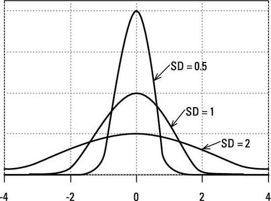
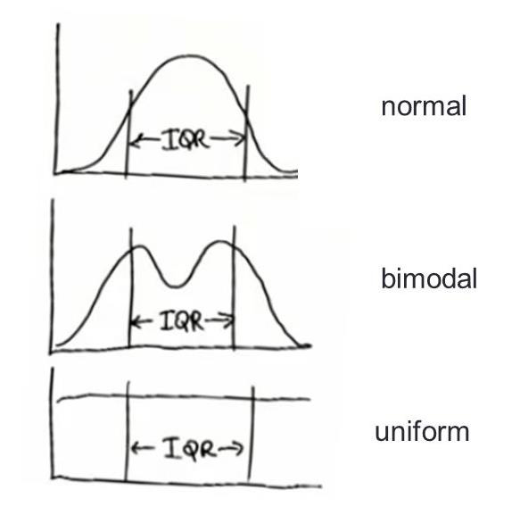
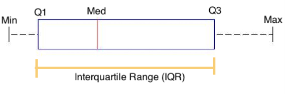
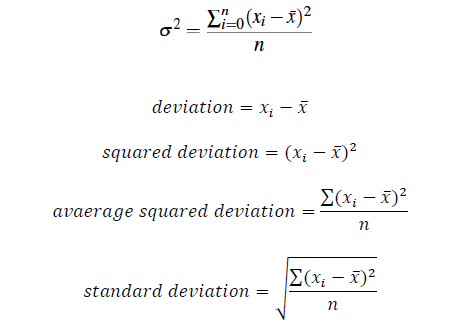
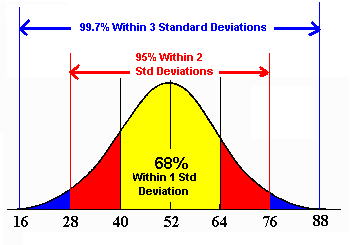
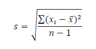

# VARIABILITY

- All 3 distributions have same mean, median & mode. They differ in the way they spread out.
- Range (max-min) to indicate how spread out the distribution is not robust, since it’s based on only two data points and if they are outliers you get a wrong picture.
- Interquartile range (IQR) is the distance between the 1st quartile and 3rd quartile and gives the range of the middle 50% of data. It’s not affected by outliers.
- IQR is found by: Q3 - Q1
- You can use the IQR to identify outliers:

      • Upper outliers: Q3 + 1.5(IQR) Anything higher
      • Lower outliers: Q1 - 1.5(IQR) Anything lower
- Varying distributions can have the same IQR

- A box plot (box & whisker plot) visualize quartiles & outliers. 
Outliers are represented as dots. It is a great way to show the 5 number summary of a data set in a visually appealing way. 
The 5 number summary consists of minimum, first quartile, median, third quartile, and maximum.

- variance is the average of the squared differences from the mean. 
Standard deviation is the square root of the variance and is used to measure distance from the mean.
- 
- In a normal distribution 68% of the data lies within 1 standard deviation from the mean, 95% within 2 standard deviations, and 99.7% within 3 standard deviations.
- 
- When you use a sample, sample’s standard deviation tends to be lower than population’s standard deviation since sample may not spread out as the population.
- Bessel’s Correction corrects the bias in the estimation of the population variance, and some (but not all) of the bias in the estimation of the population standard deviation. 
To apply Bessel’s correction, use (n - 1) instead of n. Resultings is called sample standard deviation.
- 
- Use Bessel’s correction primarily to estimate the population standard deviation.
