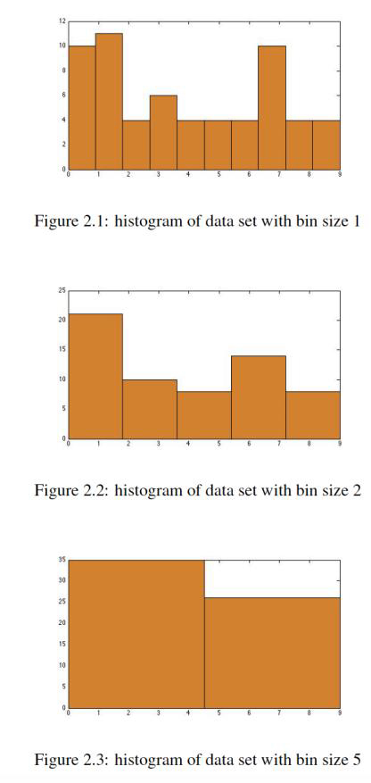
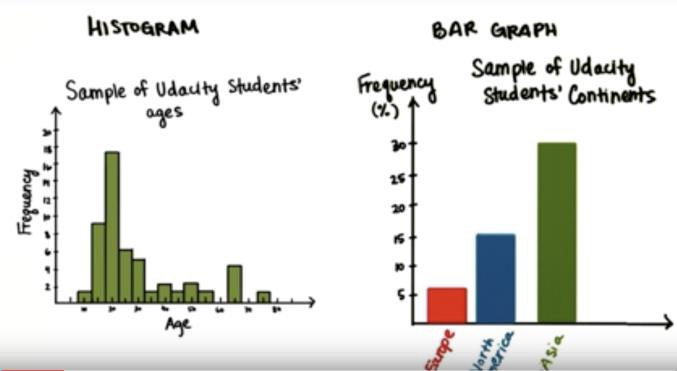
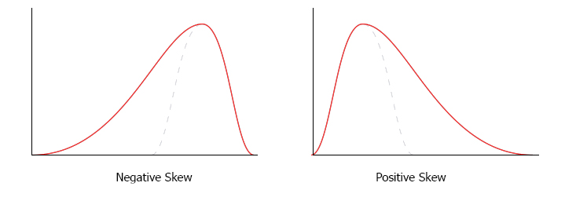

# 데이터 시각화

- 데이터 세트의 **빈도(frequency)** 는 어떠한 결과가 발생하는 횟수입니다.
- 빈도 표(frequency table)는 결과와 빈도를 표로 만든것 입니다.

- 비율(proportion)은 전체 표본에 대한 수치의 분수입니다.
- 백분율(percentage)은 비율에 100을 곱한것입니다.

      • RF = 상대 빈도(relative frequency)= 비율
      • RF = 빈도 / 총 수
      • 0 <= RF <= 1
      • 합계 (RF) = 1
      • 백분율 = RF * 100
      • 0 <= 백분율 <= 100 %

- 원하는 질문에 따라 데이터 구성합니다.

- **히스토그램(histogram)** 은 데이터의 분포를 그래프로 표현한 것입니다.
- 빈도는 y 축에 있고 변수는 x 축에 있습니다.
- 축의 교차점은 원점(origin)입니다. 그것의 데카르트 좌표(Cartesian)가 우리가 0 축과 2 축 모두에 있다면 (0,0)입니다.
- It depends on what questions you want to answer.

- discrete intervals (bins) are decided upon to form widths
for our boxes. Bin size (interval size) is the interval in which
you’re counting the frequency. Shape of the histogram
changes with the bin size. Adjusting the bin size of a
histogram will compact (or spread out) the distribution.

- Histogram is better for analyzing the shape of a distribution
of data. Frequency table is better for calculating n.

| Histogram| Bar graph| 
|:-------------:|:-------------:|
| Can choose any interval or bin size| spaces in between columns means that each of them is one distinct category| 
| Can change the bin size| Not possible to change an interval like that| 
| Order matters, it goes from low to high along xaxis| Variable on x axis is categorical or qualitative| 
| Variable on x axis is numerical & quantitative| Bar graph| 
| Shape is very important| Shape is arbitrary| 

Biased Graphs
## Skewed Distribution
- A **positive skew** is when outliers are present along the right
most end of the distribution
- A **negative skew** is when outliers are present along the left
most end of the distribution

